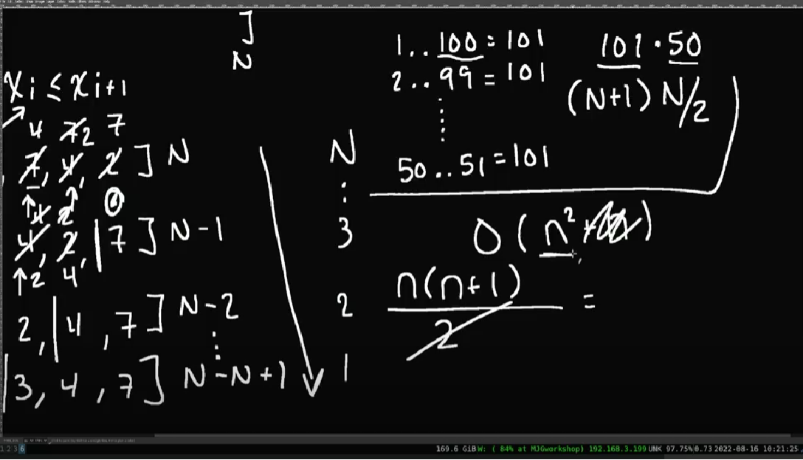

# Bubble Sort

## [Notes](./notes.md)
<br>

In a nutshell: The Bubble Sort algorithm starts from the first (0th) position in the array and goes through the whole collection and it checks: if the current element is greater than next (+1 is the next to me), then they're swapped.

Example
```text
array = [1, 3, 7, 4, 2]

We go through array and test

Is 1 greater than 3? No, no swap.
Is 3 greater than 7? No, no swap.
Is 7 greater than 4? Yes, swap.

[1, 3, 4, 7, 2]

Is 7 greater than 2? Yes, swap.

[1, 3, 4, 2, 7]

First iteration is finished.
```

> By a singular iteration, what happens in bubble sort? The largest item is where in the array? **It's at the end**. So a singular iteration will always produce **the largest item** in the last spot.

> The next time we do bubble sort, it means we only have to go up to but **not include** the last position, because that is already sorted, we don't need to look there.

```text
[1, 3, 4, 2, 7]

We again go through array and ask

Is 1 is greater than 3? No, no swap.
...
Is 4 is greater than 2? Yes, swap.

Here we finish, because we don't include the last spot, there is already largest item (7).

Now we do the same and 4 is the last largest item. So we don't include.

We continue, until our array is sorted out.
```

What's the complexity? O(N^2).



