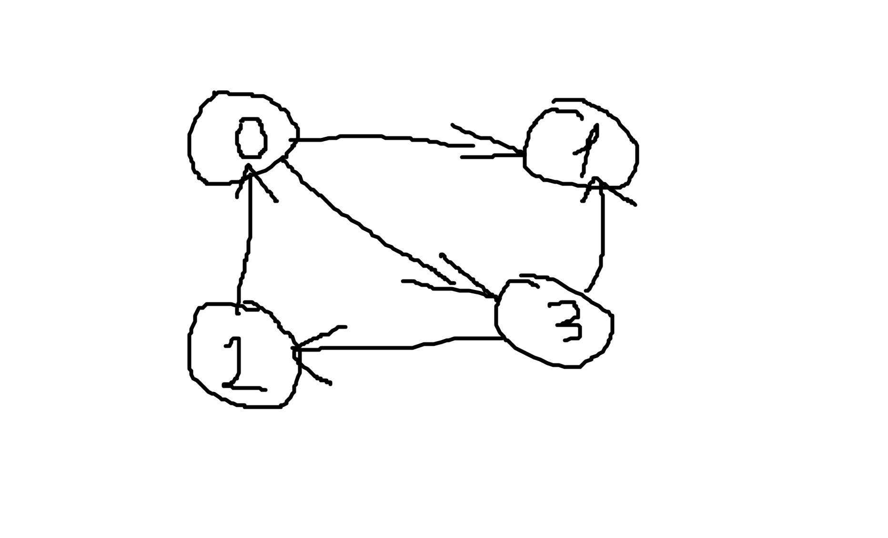

# Graphs

## [Notes](./notes.md)
<br>

- [Fundamentals](#fundamentals)
- [Graphs representation](#graphs-representation)
    - [Adjacency list](#adjacency-list)
    - [Adjacency matrix](#adjacency-matrix)
- [Basic Searches](#basic-searches)
- [Dijkstra's shortest path](#dijkstras-shortest-path)
    - [Time Complexity](#time-complexity)
- [Conclusion](#conclusion)

## Fundamentals

> A graph, as simple as it is put, is a series of nodes with some amount of connections.

> There's no rules. It's not like, you can only be top down. It can only have a left or a right. It's just, there's a lot of connections, or some connections, or no connections.


> This is not an exhaustive list of terms  
> Graph Terms
> - cycle: when you start at Node(x), follow the links, and end back at Node(x) [at least 3 nodes, I can visit them and I can go back to myself]
> - acyclic: a graph that contains no cycles
> - connected: when **every node** has a **path** to every other node
> - directed: when there is a direction to the connections. (connections have arrows). Meaning that there are one-way connection or the connections are *asymmetric* (from one node you can get to another with cost of 10, but from that another node you can get to previous with cost of 20; think of road traffic).
> - undirected: !directed, you can go both ways.
> - weighted: the edges have a weight associated with them. In an undirected graph the weight will be for both directions (symmetric relationship). Think of Maps
> - dag: d - directed, a - acyclic g - graph.

> Implementation Terms  
> - node: a point or **vertex** on the graph
> - edge: the connection between two nodes

> Big O  
> - BigO is commonly stated in terms of V and E where V stands for vertices and E stands for edges.  
> - So O(V * E) means that we will check every vertex, and on every vertex we check every edge.

## Graphs representation

Two ways:
- adjacency list
- adjacency matrix
- graph-node structure (node has a reference to other nodes), not used very often

### Adjacency list

This is the most used one. You will rarely see adjacency matrix, because it takes a lot of memory and setup to be able to do, and the complexity of adjacency matrix is O(V^2). (Prime)

Imagine you have a graph like this



> So an adjacency list will be a list in which the index maps to this. So 0 represents node zero. So node zero will have a list of edges.

```js
[
    // node zero (see image)
    [
        // edges (object or tuple)
        // structure: where it's going + weight
        // could be a tuple, it's not necessary to have an object
        { to: 1, w: 10 },
        { to: 3, w: 5 }
    ],
    
    // node one, it's terminal (doesn't have any edges)
    [],
    
    // node two
    [
        { to: 0, w: 4 }
    ],

    // node three
    [
        { to: 2, w: 5 },
        { to: 1, w: 5 }
    ]
]
```

> So it's a list of edges in this, in other words, an adjacency list. What am I adjacent to? Adjacency meaning you have a connection to.

### Adjacency matrix

```js
// each node is a row
// if node has a connection with the other we put the weight of this connection, otherwise 0
[     0  1   2   3    // <- nodes
  0 [ 0, 10, 0,  5 ]  // each row and each column is a node
  1 [ 0, 0,  0,  0 ]
  2 [ 4, 0,  0,  0 ]
  3 [ 0, 5,  5,  0 ]
]
```

> The problem, of course, again, is memory and how you have to represent it. If you had 100 nodes,you'd have to create 100 by 100 matrix to be able to represent it all. If you had 1000 nodes, it grows. If it's sparsely [small number of connections] connected you're gonna use a ton of memory to represent a few points of connection.  
And as you can imagine, you could just never use one of these for say maps. You'd only just have just a little bit of a city in there, and you'd have so many connections that this thing would immediately explode.

## Basic Searches

DFS and BFS are almost the same as with the trees. We can use them.

> Normally in a tree operation, we don't consider path. It's usually irrelevant cuz we're just going down until we find the value. But in a graph, when we're doing a search, we often want the path or something associated with it.

BFS on adjacency matrix looks like this (pseudocode):

```text
do {
    curr = Q.deque()
    
    if curr == needle:
        break
    
    for c in curr:
        if notConnected:
            continue

        if seen:
            continue
        
        seen[c] = true
        # c was added by current
        # We know who brought us in this search
        # By doing that, that will give us our path backwards through our search (Prime)
        prev[c] = curr

        Q.enqueue(c)
} while (Q.len)

# if this true, we know that we never got to the needle
prev[needle] == -1
# otherwise, we found our needle and we know who put into the prev array
# we know who the parent of that prev who put our needle etc. 
# we go backwards
```

This is important note (summary from chatGPT):

> In BFS or DFS, when exploring a graph (whether weighted or unweighted), you mark nodes as visited and **don’t revisit them** [seen array, remember?]. This ensures you don’t explore the same node twice, even if the first path found isn’t the optimal one. Algorithms like Dijkstra's or Bellman-Ford are used to find the best path in weighted graphs. Backtracking after BFS helps reconstruct the path efficiently, as maintaining multiple paths during the search would be less efficient and more complex, especially if some paths don’t lead to the target.

You could go forward search, but you need to maintain paths. Because theoretically all your descendants could lead to the target (computer cannot visualize the graph like humans). Do you understand? You would need to go through the first path, and then the second etc. That's why it's less efficient and it's better to track the parent of each node using `previous` array. So when you visit the node, you mark as **visited** (see chatgpt response) and set its parent (from which node you arrived at the current node). Then you perform backtracking.

See `BFSGraphMatrix.ts`. BFS is performed on adjacency matrix (you could perform it on a list as well, it doesn't matter if it's a list/matrix) and the time complexity is O(V^2), because of how adjacency matrix is stored.

See `DFSGraphList.ts` for DFS on adjacency list. The time complexity is O(V + E). At worst, we need to visit every node (vertex) and every connection (edge) the node has with other nodes.

## Dijkstra's Shortest Path

> So what is Dijkstra shortest path? Obviously, it is calculating the shortest path from one node to **all other nodes** in the graph. Which means we can also specifically find it to an individual node as well.

Algorithm works only with positive weights!

Dijkstra's algorithm initially started with V-squared running time, but you can optimize it. (for instance, use a proper data structure)

We still need to remember (previous array, see more in BFS and DFS), who brought this node, so we can walk. We can also have `seen` array (already visited nodes), but it's not necessary. Depends on the chosen data structure.

There is also another array we need - `distances`, this will store distances from one node to another. Initially, the start node has a distance of 0 and others have a distance of `Infinity`. In the array we put 0, wherever our source (start node) is. Same with `seen` array (set true, where source is, others are false).

> So effectively how Dijkstra shortest path works, is that we get the **nearest** unseen node, or **unvisited** node, meaning at first that's just our source array, right? Because everything else has infinity.   
So those ones are unvisitable, but our source one is visitable at a distance of 0, right? Right, so you can imagine one way to do this, is we scan through our distance array. And when we get to zero we're like hey have I seen you yet? I haven't seen you, awesome, we're gonna start with this one cuz this is obviously the smallest distance, let's start right here, cuz the rest of the distance is our infinity.

> So, during the first iteration of the graph, we get the source node, which is the closest possible node because it's 0. The next iteration, we are gonna find the closest possible node to the source and that is the shortest distance.   
No matter how you bake it, that is always gonna be the shortest distance because you can kind of argue that in your own head. If you have an entire series of node and you find the shortest distance from where you start to the next node, that will always be the shortest distance **at that point**, right? You can never make it any shorter, but then this is where it gets interesting. If you use the distance to that node, plus the distance to all the nodes it's connected to versus the distance to all the nodes I'm connected to.
Whatever is the shortest that time becomes the next possible shortest path that is possible in your graph.

```text
# 0 in prev is our source
prev = [-1, 0, ...]
# true in seen is our source
seen [false, true, ...]
# 0 in dists is our source
dists = [Infinity, 0, Infinity, ...]

while hasUnvisited() {        <- O(V^2)
    lo = getLowestUnseen()    <- O(V^2)
    seen[lo] = true

    for edge in lo {          <- O(E)
        # we've already seen this node
        if seen[edge] continue

        # distance to me + distance to you is shorter than any other distance we've seen so far - new shortest distance

        distance = distances[lo] + edgeWeight

        if dist < dists[edge] {
            # we set the parent of that node (how we got to this node) and we update it with the shortest distance
            prev[edge] = lo
            dists[edge] = dist
        }
    }
}
```

> We keep on getting the lowest distance node and then trying to update all the other distances based on this new lowest path we found and it's greedy [algorithm]. So each time you find the shortest path that literally is the shortest possible path within the graph at that individual moment.

> So again, we have to do the exact same thing we've done before, meaning that when we want to build this path, we do need to walk backwards again through, we have our previous array. We start from our needle and then we're gonna have to walk backwards we just got done doing that, we will do it again if we implement Dijkstra shortest path.

See implementation in `DijkstraList.ts` (it's not the best, btw).

### Time Complexity

Time complexity is O(V^2 + E). NOTE: it's not O(V^2 + E)! Because you walk only through the edges that connected to the node, not through all edges. O(V\*E) would be, if you used adjacency matrix.

You can optimize the algorithm by using `MinHeap` (min priority queue). You don't need to remember the seen array, because we have the lowest distance on top and we remove, so we can't see it and `hasVisited` becomes very simple. But you need to perform heap update (either heapify down or up, depending on the how the distance was changed) in edge relaxation (setting distance, if check is true).

And the final complexity will be O(V*log(V) + E).

### Conclusion

Graphs are pretty useful, but complex. Sometimes on the interview you can get a problem, like Number of Islands.
