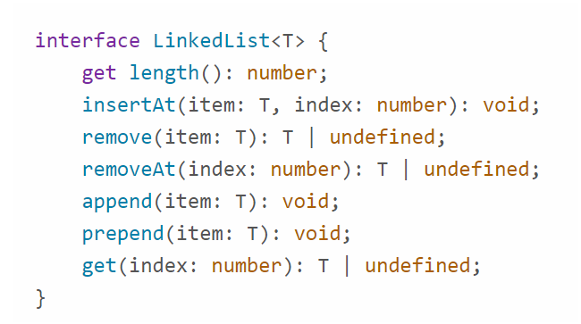

# Linked List

## [Notes](./notes.md)
<br>

What sucks about array?

- Deletion - you just set the value to null, you don't really *delete*
- Insertion - you don't insert, but rather you write
- It's ungrowable - why? It's fixed length and we don't want to clash with the other memory, array is not a dynamic structure.

Linked List, often called a **node** (type of container that wraps our data) based data structure. There two types: singly linked and doubly linked.

> So, in a linked list how you can think of it, is that, if you have a series of values... What you're going to see, is that you're going to see data organized in such a way that, you will not only be able to visit say this node it will point to the next node.

Head is the first element of the linked list. Tail is the last. But there are no indexes!

List consists of the **nodes** (containers). So you have a container, node, and it has a value inside of it AND a reference (which often called *next*) to another value/node.

It's called a **singly** linked list (reference only to the next node). For instance

```text
A -> B -> C
```

So A points to B and B to C and you can walk forward, but you cannot go backwards, because you don't have a link to the previous node. Only to the next. 

If the node has a link to the previous node (often called *prev*), when we talk about *doubly* linked list.

And we get bidirectional relationship

```text
A <-> B <-> C
```

We can go from A to B, or from B to A, etc.

> So instead of using an array, it [Linked List] uses a heap allocated objects, and puts them.

You don't have indexes like in array, you need to traverse through the links.

> Heap allocated objects of course mean objects that are stored in some magical memory place, which is usually more expensive than stack.

## Operations

- Insertion is constant operation (if we insert in the beginning/end, otherwise we need to traverse so O(N) + O(1)), because we just change references in next and prev properties. Nothing is based on input. It's O(1) - constant complexity. Of course there is constant *c* in O(c*1), and practically speaking this does matter, but it's big O, we drop constants.

- Deletion is also a constant operation. It's NOT based on how big your input is, you just change links and thus the operation is constant, O(1). However, if you need to delete not from beginning/end it's O(N) + O(1), because you need to traverse through the list.

IMPORTANT: the order of operations does matter. For example

```text
B <-> C <-> D
```

We want to delete C. We need to set B.next to C.next (which is D), and if we accidentally say C.next = undefined, we no longer have access to D!

So the correct order is

```js
let B = C.prev;
let D = C.next;

// usually you put guards like if (B) then B.next = D, etc.
B.next = D;
D.prev = B;

C.prev = C.next = undefined; // by the way, this is a chain assignment in JS
```

## Searching

So, because we don't have indexes, we just loop through the list. We traverse through the links to find the value, we're looking for. So it's a linear operation, O(N).

Notice that we don't want to return the containing node, because

> Then we leak our containing thing, and then someone can mess with the next and previous values, and boom our whole list sucks and you lose everything.

> It's our abstraction for ourselves, not for the outside world.

## Get head/tail

A constant operation, since we can define these values and no matter how big is our list, we get a head node or tail node and it's just a constant operation.

## Deletion from ends, deletion in the middle

If you delete from the end, it can be a constant operation, because all you have to do is just to update the links.

But deletion in the middle can be costly, if the traversal is costly.

Deletion itself is not costly, because it's a constant operation.

## Prepend/Append

Constant operation.

## Insertion in the middle

Again, like with the deletion in the middle, it can be costly, if the traversal is costly.

## Pros and cons of the linked list

Pros:
- The list can be whatever size you want
- Deletion from the front/back are extremely fast

Cons:
- A bit more complicated. It's not a contiguous memory like an array, and you need to deal with a lot of pointers.

Typical structure of linked list



> So in general, I can't tell you how to use a LinkedList, cuz you use a LinkedList how you want to use a LinkedList, but I would strongly recommend not traversing.

> Anytime you do an n length algorithm, there's probably a data structure that's better at it, right?